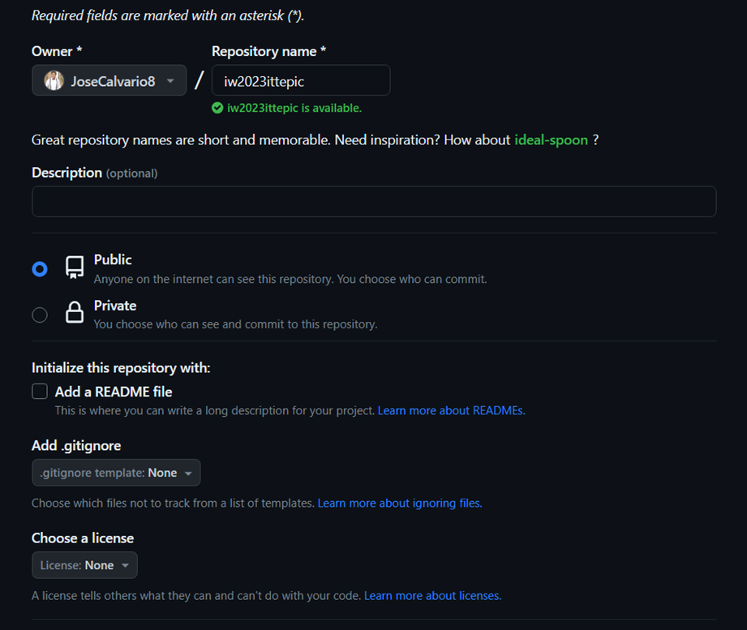
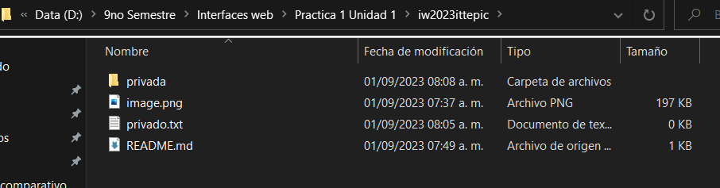
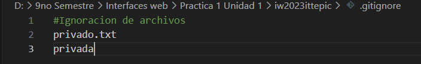

#Practica Unidad 1 - GIT

En esta practica veremos los comandos basicos para poder crear un repositorio en git asi como tambien añadiremos informacion al archivo README.md entre otras cosas

#Comandos usados para la practica

1.- Primero crearemos el repositorio mediante la interfaz grafica de GitHub:

2.- Despues clonaremos el repositorio con el siguiente comando:

 git clone https://github.com/JoseCalvario8/iw2023ittepic.git

 3.-Crearemos el archivo README.md con el comando:

 touch README.md

 4.-Escribiremos en el archivo README todos los comandos utilizados en la practica y despues haremos un commit y un push:

    git add README.md
    git commit -m "Initial commit"
    git push

5.- Crearemos en el repositorio local un fichero llavado privado.txt:

  touch privado.txt

6.- Tambien crearemos una carpeta llamada privada

  

7.- Ignoraremos estos dos archivos mediante el .gitignore (es decir crearemos ese archivo mediante el touch gitignore y dentro especificaremos los archivos ignorados privado.txt y privada)

  

  (En la foto se aprecia como se debe escribir dentro del archivo .gitignore para que se ignore los archivos deseados)
  git add .gitignore
  git commit -m "Archivos ignorados"

8.-Crear un archivo y un tag

    touch 1.txt
    git tag v0.1

9.- Creacion de tabla con informacion acerca de 5 compañeros de clase
| Nombre | GitHub  |
| ------------ | ------------ | 
| CARRILLO RUBIO JOSÉ GIOVANNI   | https://github.com/josecar2505   | 
| DE ROBLES RAMIREZ MIGUEL ISRAEL    | https://github.com/MDeRobles  |
| ESTRADA GARCÍA CHRISTOPHER JAIR    | https://github.com/EsGaCristo | 
| RAMÍREZ REA ERICK DARIO    | https://github.com/Elery2711 | 
| PACHECO ROSALES VICTOR MANUEL    | https://github.com/XxXelbichoXxX |  

    

